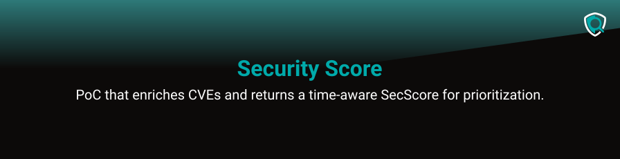

[](https://github.com/nicokempe/secscore)

## Description

This Security Score Proof of Concept is a lightweight Nuxt + Nitro web app that lets you paste any CVE ID and returns a time-aware threat score (SecScore) enriched with public signals (NVD, EPSS, CISA KEV, ExploitDB, OSV). After reading the paper [SecScore: Enhancing the CVSS Threat Metric Group with Empirical Evidences](https://arxiv.org/abs/2405.08539) and searching for an open, usable proof-of-concept I could not find one that matched the paper’s approach or my practical needs, so I decided to build this PoC to experiment with the model, combine it with real public feeds, and adapt the scoring and UX for realistic vulnerability prioritization. The project intentionally avoids a database (using Nitro caching and routeRules), exposes a simple UI and API, and keeps the model, parameters and evidence fully transparent for reproducible research and extension.

## Features

- 🔍 Enter any CVE ID and get an instant SecScore with current threat context
- 🌐 Powered only by public data sources: NVD, EPSS, CISA KEV, OSV, and ExploitDB
- ⚡ Lightweight design — no database, just Nitro caching and smart route rules
- 📊 Combines CVSS base metrics with exploit probability and real-world signals
- 📝 Transparent explanations show why a CVE is prioritized (PoC found, KEV flag, EPSS score)
- 🎨 Clean and intuitive Nuxt frontend for quick lookups and demos
- 🧩 Fully open-source, easy to extend with additional APIs or custom scoring logic

## Development Guide

This project is built with **Nuxt 3 + Nitro** and uses **pnpm** as the package manager.

### Prerequisites

- [Node.js 22+](https://nodejs.org/en/)
- [pnpm](https://pnpm.io/) installed globally:
  ```bash
  corepack enable
  corepack prepare pnpm@latest --activate
  ```

## Data sources & refreshing

| Dataset                                                           | Purpose                                              | Refresh guidance                                                                                                                                                     |
|-------------------------------------------------------------------|------------------------------------------------------|----------------------------------------------------------------------------------------------------------------------------------------------------------------------|
| **CISA Known Exploited Vulnerabilities** (`server/data/kev.json`) | Flags vulnerabilities actively exploited in the wild | `curl -s https://www.cisa.gov/sites/default/files/feeds/known_exploited_vulnerabilities.json -o server/data/kev.json` then restart (or run `nitro task kev:refresh`) |
| **ExploitDB snapshot** (`server/data/exploitdb-index.json`)       | Highlights public PoCs with publish dates            | Regenerate the curated JSON with `cveId`, `url`, and `publishedDate`; restart to load                                                                                |
| **Model parameters** (`model-params/al-params.json`)              | Controls category-specific exploit timing curves     | Adjust `{ mu, lambda, kappa }` and redeploy/restart                                                                                                                  |

## API surface

| Endpoint                    | Method | Description                                                                                                                                          |
|-----------------------------|--------|------------------------------------------------------------------------------------------------------------------------------------------------------|
| `/api/v1/cve/:cveId`        | GET    | Returns normalised CVE metadata plus SecScore context. Validates identifiers, emits cache headers, and tags responses with `SecScore-Model-Version`. |
| `/api/health`               | GET    | Exposes process uptime, CPU/memory usage, and KEV dataset metadata for monitoring.                                                                   |
| `/api/internal/refresh-kev` | GET    | Triggers a KEV dataset refresh (protect behind auth when deploying).                                                                                 |

The public API routes inherit a per-IP rate limit of 120 requests per hour. Cache hits are labelled via an `X-Cache` header so you can monitor effectiveness.

## Configuration

These environment variables customise behaviour at runtime:

| Variable                          | Description                                                             |
|-----------------------------------|-------------------------------------------------------------------------|
| `CLOUDFLARE_TURNSTILE_SITE_KEY`   | Enables the Turnstile widget on the frontend when set.                  |
| `CLOUDFLARE_TURNSTILE_SECRET_KEY` | Required to validate Turnstile tokens server-side.                      |
| `LOG_LEVEL`                       | Sets client logging verbosity (default `info`).                         |
| `LOG_REMOTE_ENABLED`              | When `true`, allows forwarding logs to `LOG_SERVER_URL`.                |
| `LOG_SERVER_URL`                  | Remote logging endpoint (default `https://logs.secscore.net/api/logs`). |

### Setup

Install all dependencies:

```bash
pnpm install
```

### Development Server

Start the development server on [http://localhost:3000](http://localhost:3000):

```bash
pnpm dev
```

Hot module replacement (HMR) is enabled, so changes are applied instantly.

### Production

Build the application for production:

```bash
pnpm build
```

Preview the production build locally:

```bash
pnpm preview
```

### Deployment

Nuxt/Nitro supports multiple deployment targets (Node, serverless, edge, etc.).
Refer to the [Nuxt Deployment Docs](https://nuxt.com/docs/getting-started/deployment) for configuration.

## License

This project is licensed under the [Apache License](https://github.com/nicokempe/secscore/blob/main/LICENSE).
